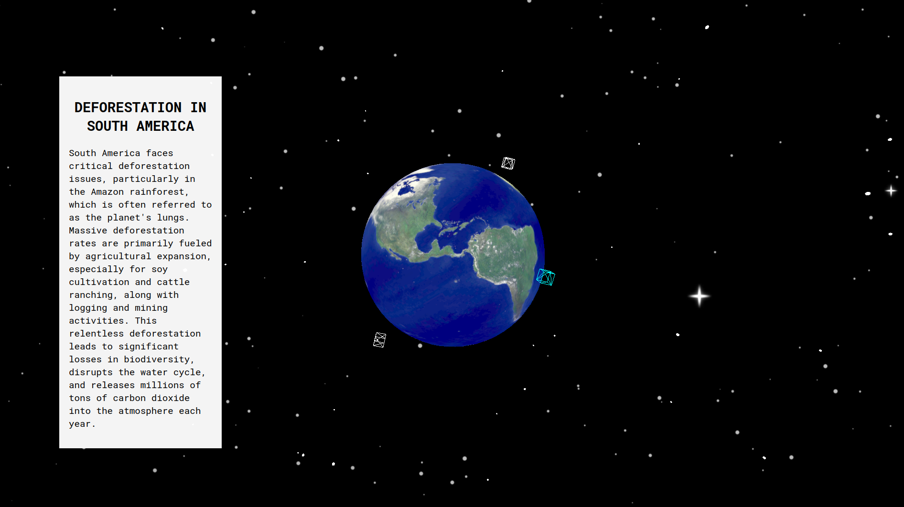

# Planet-Earth

## Introduction

**Planet-Earth** is a web application developed with Vite and ThreeJS to create a dynamic 3D representation of Earth. This project focuses on illustrating various ecological problems our planet faces, aiming to raise awareness through interactive visualization.

## Live Demo

See the project in action [here.](https://planet-earth-ebon.vercel.app/)

## Features

-   **3D Globe Visualization**: Users can interact with a rotatable 3D model of Earth.
-   **Ecological Issue Highlighting**: Key ecological problems are highlighted directly on the globe.
-   **Detailed Information**: Clickable areas on the globe bring up detailed information and statistics about specific ecological threats.

## Technologies Used

-   **Vite**: A modern front-end build tool that provides a faster and more efficient development experience.
-   **ThreeJS**: A JavaScript library that allows for the creation and display of animated 3D computer graphics in a web browser.
-   **CSS3**: Used for styling and animations.
-   **HTML5**: The standard markup language for documents designed to be displayed in a web browser.

## Setup and Installation

Follow these steps to set up and run the project locally:

    git clone https://github.com/tadej-jernejcic/planet-earth.git
    cd planet-earth
    npm install
    npm run dev # for development

## License

This project is open source and available under the MIT License.
